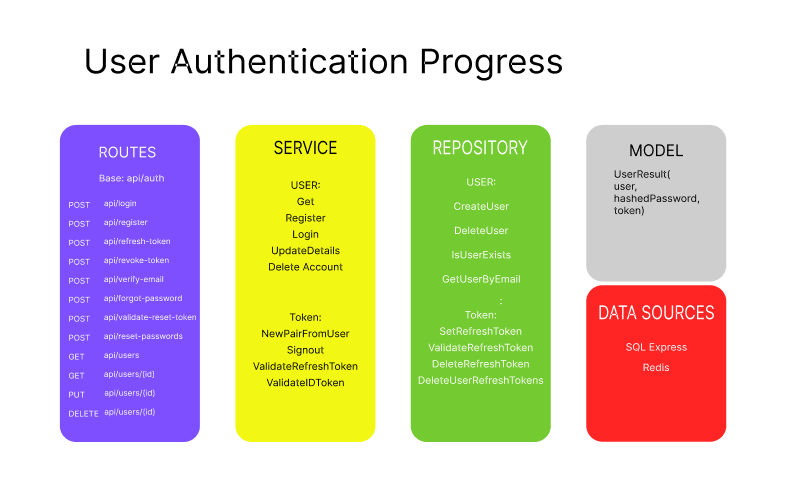

This is a boilerplate project for authentication and authorization in ASP.NET Core 6 with JWT and refresh tokens. It will include the following features shown below. The project is currently in the early stages of development. The following features are planned to be implemented in the future:
### Routes Overview

[SRC-1 hash-and-verify-password](https://jasonwatmore.com/post/2022/01/16/net-6-hash-and-verify-passwords-with-bcrypt)
[SRC-2 Email-Authentication-ForgotPass](https://jasonwatmore.com/post/2022/02/26/net-6-boilerplate-api-tutorial-with-email-sign-up-verification-authentication-forgot-password)

-> Query
-> Command
- **POST /api/auth/login -> Query**: This is a public route that accepts POST requests. It expects an email and password in the body. Upon success, it returns a JWT access token along with basic account details. Additionally, it sets an HTTP Only cookie containing a refresh token.

- **POST /api/auth/refresh-token -> Command**: Another public route that accepts POST requests. It requires a cookie with a refresh token. Upon success, it provides a new JWT access token with basic account details. It also sets an HTTP Only cookie containing a fresh refresh token. (Refer to the explanation below for refresh token rotation.)

- **POST /api/auth/revoke-token -> Command**: This is a secure route that accepts POST requests. It expects a refresh token either in the request body or in a cookie. If both are present, the request body is given priority. Upon success, the token is invalidated and can no longer generate new JWT access tokens.

- **POST /api/auth/register -> Command**: Another public route accepting POST requests containing account registration details. Upon success, the account is registered. A verification email is sent to the account's email address. Authentication requires account verification.

- **POST /api/auth/verify-email -> Command**: Public route for verifying an account via POST requests containing an account verification token. Upon success, the account is verified and ready for login.

- **POST /api/auth/forgot-password -> Command**: Public route accepting POST requests with an account email address. On success, a password reset email is sent to the account's email. It includes a single-use reset token valid for one day.

- **POST /api/auth/validate-reset-token -> Query**: Public route accepting POST requests containing a password reset token. It returns a message indicating the token's validity.

- **POST /api/auth/reset-password -> Command**: Public route accepting POST requests containing a reset token, password, and confirm password. Upon success, the account's password is reset.

- **GET /api/auth -> Query**: Secure route restricted to the Admin role, accepting GET requests. It returns a list of all application api/auth.

- **POST /api/auth -> Command**: Secure route restricted to the Admin role, accepting POST requests containing new account details. Upon success, it creates the account and automatically verifies it.

- **GET /api/auth/{id} -> Query**: Secure route accepting GET requests, returning the details of the account with the specified ID. Admin role can access any account, while api/auth role is limited to their own account.

- **PUT /api/auth/{id} -> Query**: Secure route accepting PUT requests to update account details with the specified ID. Admin role can update any account, including its role. api/auth role can update their own details, except for the role.

- **DELETE /api/auth/{id} -> Query**: Secure route accepting DELETE requests to delete the account with the specified ID. Admin role can delete any account, while api/auth role can only delete their own account.
